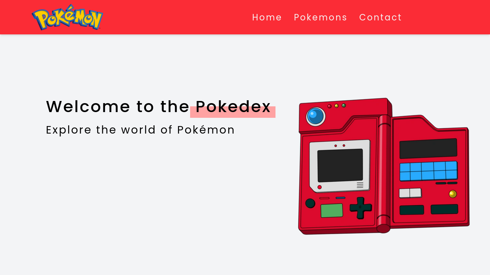
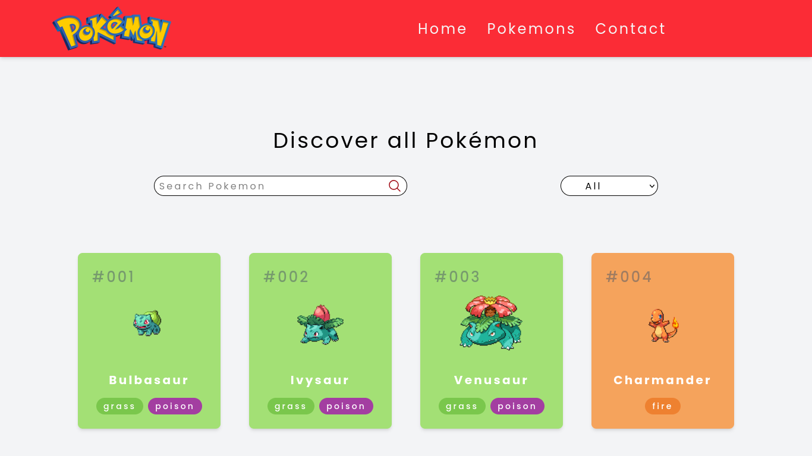
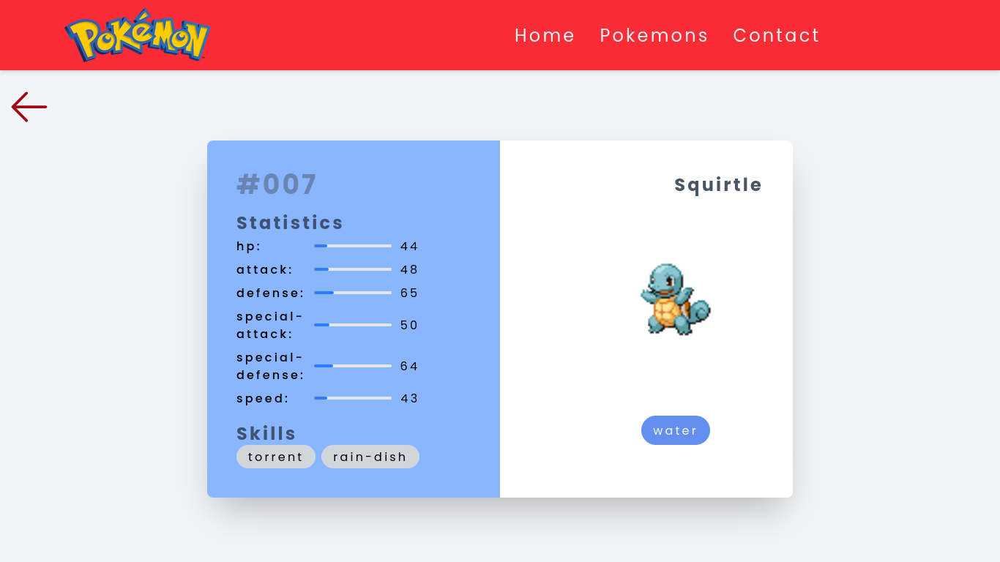
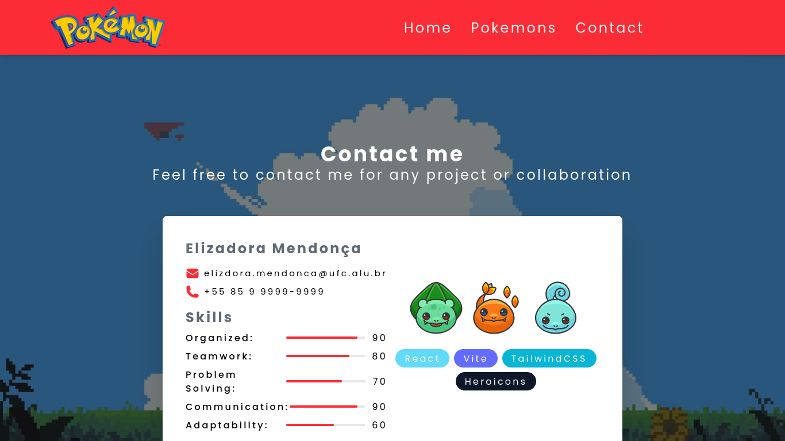

# Pokedex


## Sobre
O Pokedex é um projeto desenvolvido com React, TailwindCSS e Vite. O projeto foi desenvolvido com o intuito de estudar e praticar o desenvolvimento de aplicações web com React, além de aprender a utilizar o framework TailwindCSS e o Vite.
O projeto consome a [PokeAPI](https://pokeapi.co/) para obter os dados dos pokemons.

O projeto apresenta uma tela incial, uma tela para a visualização dos pokemons e uma tela para a visualização dos detalhes de um pokemon, além de uma tela para contato.


## Funcionalidades
- Visualização dos pokemons
- Visualização dos detalhes de um pokemon
- Filtro de pokemons por tipo
- Busca de pokemons por nome/ID 


## Tecnologias
- [React](https://reactjs.org/)
- [TailwindCSS](https://tailwindcss.com/)
- [Vite](https://vitejs.dev/)
- [PokeAPI](https://pokeapi.co/)
- [React Router Dom](https://reactrouter.com/web/guides/quick-start)
- [Axios](https://axios-http.com/)

## Guia de instalação
Abaixo segue um guia de instalação para rodar o projeto localmente.

### Pré-requisitos
- [Node.js](https://nodejs.org/en/)
- [NPM](https://www.npmjs.com/)
- [Git](https://git-scm.com/)

Abra o terminal e siga os passos abaixo:

1. Clone o repositório
```bash
git clone https://github.com/elizadora/pokedex.git
```

2. Entre na pasta do projeto e instale as dependências
```bash
cd pokedex
npm install
``` 

3. Inicie a aplicação
```bash
npm run dev
```

4. Acesse a aplicação no navegador
```
http://localhost:3000
```

Pronto! Agora você pode visualizar o projeto localmente.

## Telas do projeto
### Tela inicial


### Tela de visualização dos pokemons


### Tela de visualização dos detalhes de um pokemon


### Tela de contato
